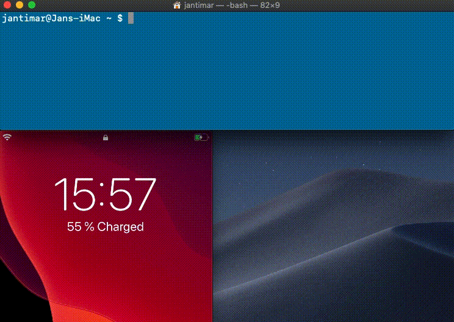

# lola

[](https://swift.org/package-manager)

[](https://twitter.com/i_binaries)

Small helper library writed in `swift` for send push notification from terminal



## Instalation

`lola` is distribute with SPM, You can easly add it to other command line tool, iOS app or server-side apps.

### Command line tools

If you want run app in terminal you can easly clone repo:
```
$ git clone https://github.com/industrialbinaries/lola
$ cd lola
```
And then install with Make:
```
$ make install
```

###  Swift package manager

In your  `Package.swift` add new package depedencie: 
```
.package(
    url: "https://github.com/industrialbinaries/lola",
    from: "0.1.0"
)
```

## Usage

### From terminal

For send push notification from terminal with `lola` you need set `mandatory` parameters

`bundleId` - bundle ID of your app f.e. in my case `co.industrial-binaries.LolaTestApp`

`device` - [device token](https://developer.apple.com/documentation/usernotifications/registering_your_app_with_apns) for your push notification

`teamId` - Apple Developer Team ID, you can find it in your [Account](https://developer.apple.com/account/) -> `Membership` -> `Team ID`

`authKey` - Name of your `p8 file` created in [Apple Keys](https://developer.apple.com/account/resources/authkeys/list)

`json` -  JSON [payload](https://developer.apple.com/library/archive/documentation/NetworkingInternet/Conceptual/RemoteNotificationsPG/CreatingtheNotificationPayload.html) of your push notification 

`notificationType` - Type of notification, this parameter is optional, when is not set payload will be send with default value `alert`. Can be one of 6 values `alert, background, voip, complication, fileprovider, mdm`

For example:
```
$ lola  \
-bundleId co.industrial-binaries.LolaTestApp  \
-device d9f1767bdbf0371f5efb25c7873f1942cf570ececde9896913ed9fdb33ac1c26  \
-teamId 9Q6922742Y \
-authKey AuthKey_JP8Z7XXKD9.p8  \
-notificationType alert \
-json "{ \"aps\": {\"alert\": \"Hi from lola 👋\", \"sound\": \"default\" }}"
```

`message` - Text which will be used in in simple alert
For example:
```
$ lola  \
-bundleId co.industrial-binaries.LolaTestApp  \
-device d9f1767bdbf0371f5efb25c7873f1942cf570ececde9896913ed9fdb33ac1c26  \
-teamId 9Q6922742Y \
-authKey AuthKey_JP8Z7XXKD9.p8  \
-message "Hi from lola 👋"
```

### From SMP dependencies

You create own instance of  `Lola`
```
let configuration = AppConfiguration(
  deviceToken: /** Your app Push token **/,
  authorizationToken: /** Token from your P8 key **/,
  bundleId: /** Bundle-id of your app **/
)

let lola = Lola(configuration: configuration)
```

Hint: For get your authorization token you can use `P8Parser`

```
let parser = try P8Parser(
  p8: /** Key of your P8 **/,
  teamID: /** Team ID of your Apple Developer account **/
)
let authorizationToken = try parser.generateToken()
```

Ten with your `lola` instance can send notification
```
lola.send(
  payload: /** Notification payload - JSON in string **/,
  type: /** Notification type **/,
  completion: /** Your completion block **/
)?.resume()
```
od for simple message
```
lola.send(
  message: /** Notification message - notification description **/,
  completion: /** Your completion block **/
)?.resume()
```

### Parse P8
Special thanks for [CupertinoJWT](https://github.com/ethanhuang13/CupertinoJWT) for parse P8 keys

## Questions or feedback?
Feel Free to contact us with any help or suggestion for improve this repository :)

## License and Credits

**lola** is released under the MIT license. See [LICENSE](/LICENSE) for details.

Created by [Jan Timar](https://github.com/jantimar) @ [Industrial Binaries](https://industrial-binaries.co).
